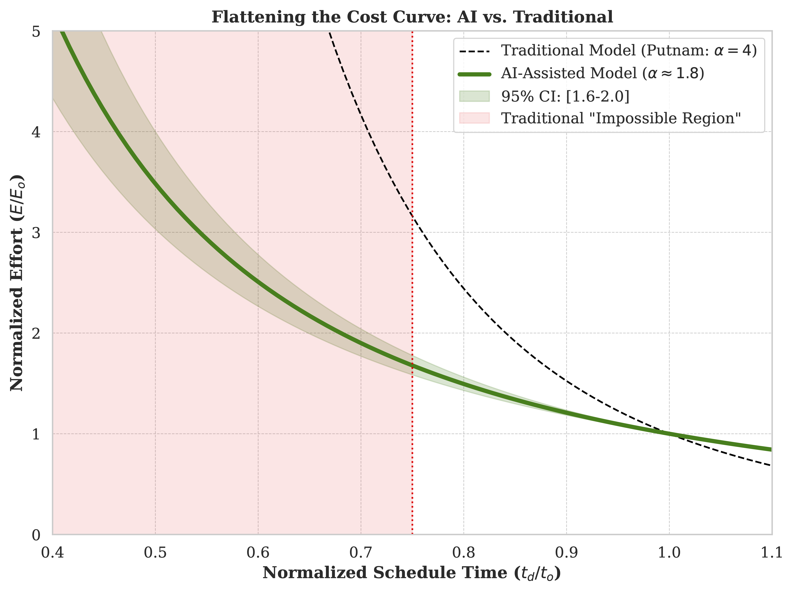

# **Revisiting the "Impossible Region": AI in Software Scheduling**

This repository contains the **datasets** and **analysis scripts** for the following research paper:

Title: Revisiting the "Impossible Region": An Empirical Study on the Impact of Generative AI on Software Project Scheduling and Effort Estimation  
Author: Mohammad Tanhaei  
Status: Under Review / Published in Journal of Systems and Software

## **📋 Overview**

Traditional software project scheduling models (most notably the **Putnam model**) postulate that compressing a project schedule below 75% of the nominal time results in an exponential increase in effort or project failure (a theoretical constraint known as the **"Impossible Region"**).

This study empirically investigates whether Generative AI tools (such as GitHub Copilot) can challenge these decades-old assumptions. By conducting a controlled experiment with **48 professional software developers**, we found that AI-assisted teams can deliver acceptable software within the traditional impossible region. The results suggest that GenAI potentially reduces the Time Sensitivity Exponent ($\\alpha$) from $\\approx 3.8$ to $\\approx 1.8$.

*Figure: Comparison of the Traditional Putnam Model vs. AI-Assisted Model. The red area depicts the traditional "Impossible Region".*

## **📂 Repository Structure**

The file structure is organized as follows:

```
git/  
├── data/  
│   └── dataset_48.csv       \# Raw experimental data (48 participants)  
├── scripts/  
│   ├── data.py              \# Script for data preprocessing and cleaning  
│   └── analysis.R           \# R script for statistical analysis and non-linear regression  
└── requirements.txt         \# List of Python dependencies
```

### **File Descriptions**

* **data/dataset\_48.csv**: Contains metrics collected from the 48 participants. Key columns include:  
  * Group: Experimental group (G1 to G4)  
  * Effort: Effort exerted (Person-Hours)  
  * Quality: Code quality score (0 to 100\)  
  * Time\_Limit: Time constraint imposed (Nominal or Compressed)  
  * Tool\_Support: Tool setup (Traditional or AI-Assisted)  
* **scripts/data.py**: Python script used for loading, cleaning, and calculating initial descriptive statistics.  
* **scripts/analysis.R**: R script for fitting the non-linear least squares model to derive $\\alpha$ and performing statistical tests (ANOVA, Tukey HSD).

## **🚀 Usage**

### **Prerequisites**

You will need **Python 3.9+** and **R** installed. First, install the required Python libraries:

```
pip install -r requirements.txt
```

### **Running the Analysis**

1. Data Preprocessing:  
   Run the Python script to prepare the data:  
   python scripts/data.py

2. Statistical Modeling:  
   Run the R script to generate the statistical results and plots found in the paper:  
   Rscript scripts/analysis.R

## **📊 Key Findings**

Based on the empirical analysis:

* **Success Rate:** AI-assisted teams achieved a **92%** success rate under "crash" schedule conditions (compared to 0% for traditional teams).  
* **Effort Penalty:** The time sensitivity exponent ($\\alpha$) in the Putnam model was significantly reduced.  
* **Security Trade-off:** While development speed increased, AI-generated code exhibited higher vulnerability rates (**28%** vs. 9%), necessitating rigorous automated security auditing.

## **📝 Citation**

If you use this dataset or code in your research, please cite the following paper:


## **⚖️ License**

This project is licensed under the **MIT License**. You are free to use the data with appropriate attribution.
